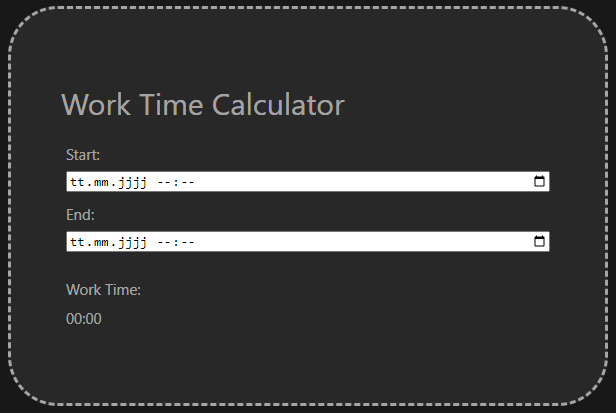
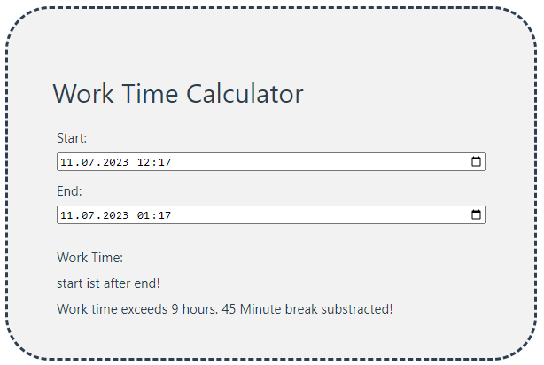

# work-time-calculator

This work time calculator projects displays the net work time by inputting the start and end of your shift.
It will automatically subtract the necessary break times (30 mins after 6 hours, and 45 mins total after 9 hours - mandatory in Germany).




## Technologies

- Vue3
- Typescript

## Project Setup

Clone the repository

```sh
git clone https://github.com/soeguet/work-time-calculator
```

Run the install and format commands

```sh
npm install
```

```sh
npm run format
```

Compile and Hot-Reload for Development

```sh
npm run dev
```

## License

The project is licensed under the [MIT License](https://choosealicense.com/licenses/mit/).
